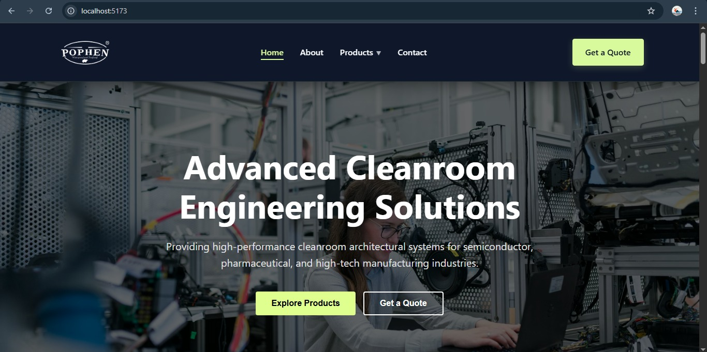
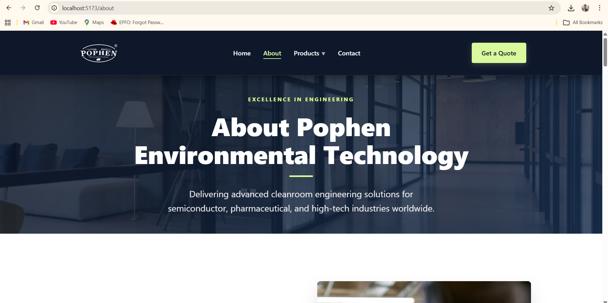
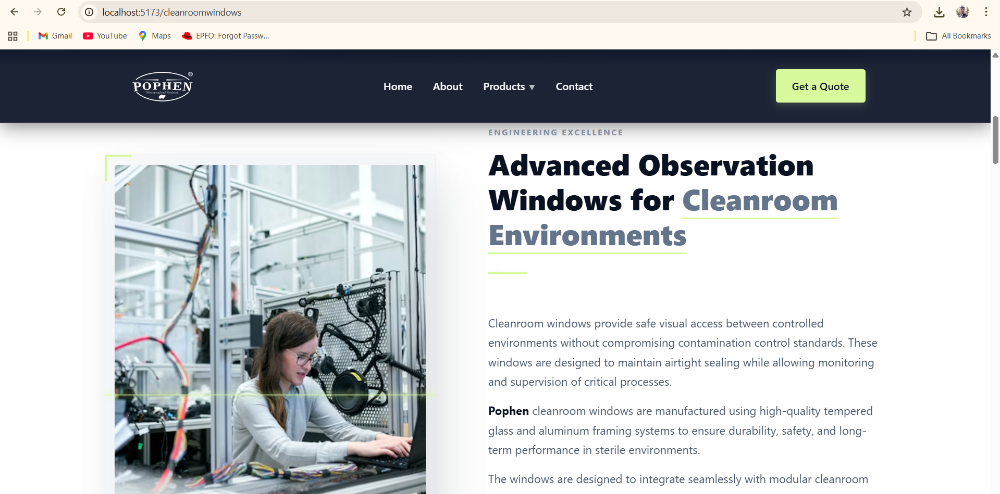
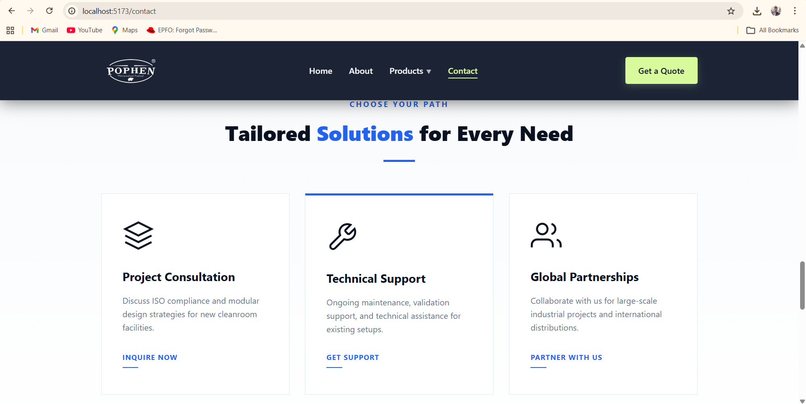

## 📸 Screenshots

<p align="center">
  
  
</p>

<p align="center">
  
  
</p>

# Pophen Website - Full Stack Cleanroom Solutions Platform

A high-performance, visually stunning full-stack application built for **Pophen India**, a leader in advanced cleanroom architectural systems. This platform serves as a digital gateway for industries like Semiconductor, Pharmaceutical, and Biotechnology, offering a seamless user experience, interactive product showcases, and a robust backend for inquiry management.

---

## 🏗️ Project Architecture

The project is structured as a decoupled monorepo, separating the frontend (client-side) and backend (server-side) for better maintainability and scalability.

```text
Pophen Website/
├── pophen-backend/             # Node.js & Express Server
│   ├── server.js               # Core API logic & Email service
│   ├── .env                    # Environment configuration (Secrets)
│   ├── package.json            # Server-side dependencies
│   └── node_modules/           # Backend libraries
│
└── pophen-website/             # Vite + React 19 Frontend
    ├── public/                 # Static assets (Favicon, etc.)
    ├── src/                    # Application Source Code
    │   ├── assets/             # Media assets (Logos, industry images)
    │   ├── components/         # Global reusable UI blocks
    │   │   ├── Header/         # Responsive navigation with dropdowns
    │   │   └── Footer/         # Informational footer
    │   ├── pages/              # Routed page components
    │   │   ├── Home/           # Dynamic landing page with animations
    │   │   ├── About/          # Company history & mission
    │   │   ├── Products/       # Comprehensive product catalog
    │   │   ├── Contact/        # Interactive form with API integration
    │   │   └── Cleanroom.../   # Specialized product detail pages
    │   ├── App.jsx             # Main router & layout controller
    │   ├── main.jsx            # Application entry point
    │   ├── index.css           # Global typography & resets
    │   └── App.css             # Layout-specific styling
    ├── index.html              # Root HTML5 template
    ├── package.json            # Frontend dependencies & build scripts
    └── vite.config.js          # Vite optimization settings
```

---

## 🚀 Technology Stack

### **Frontend: The User Experience**
- **React 19**: Leveraging the latest features for efficient component rendering and state management.
- **Vite**: Used as the build tool for near-instant Hot Module Replacement (HMR).
- **React Router DOM v6**: Manages complex routing with nested paths for specialized product pages.
- **Framer Motion**: powers high-end scroll-reveal animations, parallax effects, and smooth transitions.
- **Lucide React**: Provides a library of sleek, modern SVG icons.
- **React Helmet Async**: Optimized for SEO by managing dynamic document metadata.
- **Vanilla CSS (Modular)**: Hand-crafted, responsive styles without the overhead of heavy CSS frameworks.

### **Backend: The Engine**
- **Node.js**: Asynchronous runtime for high-concurrency request handling.
- **Express.js**: Minimalist web framework for building the contact API.
- **Nodemailer**: Integrated with Gmail SMTP for reliable automated email communications.
- **Dotenv**: Ensures security by keeping sensitive credentials out of the source code.
- **CORS**: Configured to allow secure communication between the frontend and backend.

---

## ✨ Key Features & Functionality

### **1. Interactive Landing Page**
- **Scroll-Reveal Animations**: Components fade and slide into view as the user scrolls, creating a professional and modern feel.
- **Animated Statistics**: A "Global Stats" section that counts up from zero (Countries served, SQM installed, etc.).
- **Industry Showcases**: Visual grids detailing the sectors Pophen serves, including Biotechnology and Renewable Energy.

### **2. Sophisticated Navigation**
- **Dynamic Header**: Features a sticky design with a functional dropdown menu for product categories.
- **Mobile-First Design**: A fully responsive hamburger menu with nested submenu support for seamless mobile browsing.

### **3. Comprehensive Product Catalog**
- **Categorized Products**: Dedicated pages for Panels, Ceilings, Doors, and Windows.
- **Detailed Descriptions**: Technical specifications for ISO compliance (Class 1-9), fire resistance, and modular flexibility.

### **4. Integrated Contact & Lead Generation**
- **Real-time Form Validation**: Ensures users provide necessary contact details.
- **Dual-Email System**: 
    - **Inquiry Notification**: Instantly sends full lead details to Pophen's sales team.
    - **Auto-Acknowledgement**: Sends a professional "Thank You" email to the user, improving trust and engagement.
- **API Integration**: Connects the React frontend directly to the Node.js backend using the Fetch API.

---

## 🛠️ Installation & Development

### **Step 1: Clone the Repository**
```bash
git clone <repository-url>
cd "Pophen Website"
```

### **Step 2: Backend Configuration**
1. Navigate to the backend folder:
   ```bash
   cd pophen-backend
   ```
2. Install dependencies:
   ```bash
   npm install
   ```
3. Create a `.env` file:
   ```env
   PORT=5000
   EMAIL_USER=your-professional-email@gmail.com
   EMAIL_PASS=your-secure-app-password
   CLIENT_EMAIL=sales@pophenindia.com
   ```
4. Start the server:
   ```bash
   node server.js
   ```

### **Step 3: Frontend Configuration**
1. Open a new terminal and navigate to the website folder:
   ```bash
   cd pophen-website
   ```
2. Install dependencies:
   ```bash
   npm install
   ```
3. Start the dev server:
   ```bash
   npm run dev
   ```

---

## 📧 API Documentation

### **Endpoint: `POST /send-contact`**
This endpoint processes the contact form.

**Request Body:**
```json
{
  "name": "Full Name",
  "email": "user@example.com",
  "phone": "+91 00000 00000",
  "company": "Company Name",
  "message": "Detailed project requirements..."
}
```

**Success Response (200 OK):**
```json
{ "success": true }
```

---

## 📄 License & Credits
Developed for **Pophen Environmental Technology**. All rights reserved.
Images sourced from high-quality professional photography platforms to represent industrial excellence.
